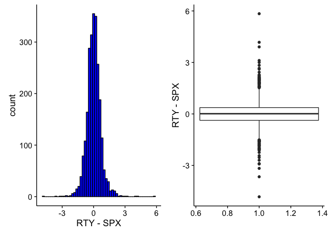
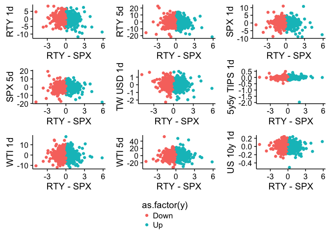
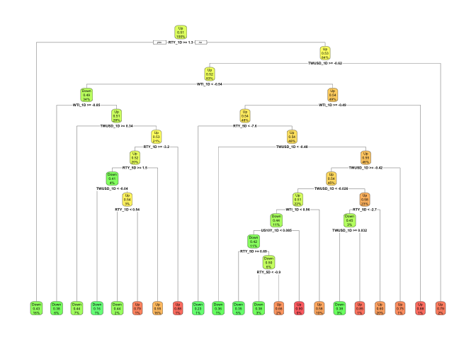
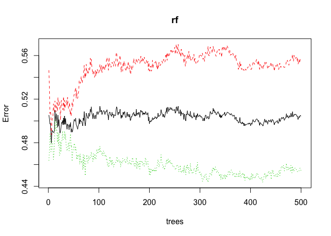

Classifying Small Cap Returns
================

(Very) Brief Theoretical Background
-----------------------------------

Stocks are driven by a multitude of different macro-economic variables, and a great deal of work has been done to predict this.

There are also many who seek to analyze the relative performance between large-capitalization (large-cap) stocks, those who's total market value exceed a certain number, and small-capitalization stocks. Stocks in each of these different groups have different dynamics. Larger companies will tend to be more international, as larger companies derive more revenue from overseas, while smaller companies tend to be more domestic focussed. Smaller companies are also more volatile, as they have a higher probability of going bankrupt but also have more growth potential.

I am looking to predict the daily difference in performance between large and small cap stocks, given the previous one-day and five-day performance for a variety of financial assets.

Summary/Goals for this Project
------------------------------

I look at each day's return as an independent datapoint, using the `Month` of the year as a categorical variable to factor in seasonality. I fit a series of models from a logit model to a random forest to predict whether small-caps will outperform large-caps on a given day.

The Data
--------

I am using data from The Federal Reserve Bank of St. Louis (FRED), downloaded as a csv.

``` r
setwd("/Users/jackholder/Documents/Columbia/Data Mining/")
d <- read.csv("Project_Data.csv")
```

Some of the data comes out as a factor, I will fix this to be a number.

``` r
d$TWUSD_5D <- as.numeric(as.character(d$TWUSD_5D))
```

    ## Warning: NAs introduced by coercion

``` r
d$TWUSD_1D <- as.numeric(as.character(d$TWUSD_1D))
```

    ## Warning: NAs introduced by coercion

``` r
d$SPX_5D <- as.numeric(as.character(d$SPX_5D))
```

    ## Warning: NAs introduced by coercion

``` r
d$SPX_1D <- as.numeric(as.character(d$SPX_1D))
```

    ## Warning: NAs introduced by coercion

``` r
d$RTY.SPX <- as.numeric(as.character(d$RTY.SPX))
```

    ## Warning: NAs introduced by coercion

``` r
d <- na.omit(d)
str(d)
```

    ## 'data.frame':    2481 obs. of  22 variables:
    ##  $ RTY.SPX   : num  -0.163 -0.4833 -0.0735 -0.1762 -0.3022 ...
    ##  $ RTY_1D    : num  0.0345 0.064 -0.588 0.0434 0.6927 ...
    ##  $ SPX_1D    : num  0.181 0.227 -0.105 0.117 0.869 ...
    ##  $ WTI_1D    : num  -0.768 -1.289 -0.326 0.459 1.858 ...
    ##  $ TWUSD_1D  : num  0.2927 0.0765 0.0285 0.0184 0.0565 ...
    ##  $ X1MLUSD_1D: num  0 0 0 0 0 0 0 0 0 0 ...
    ##  $ X3MLUSD_1D: num  0.0025 0.00437 0 0 0.00063 0.00437 0 0 0 0.00063 ...
    ##  $ X3M1M_1D  : num  0.0025 0.00437 0 0 0.00063 0.00437 0 0 0 0.00063 ...
    ##  $ US1Y.FF_1D: num  0.05 -0.01 -0.01 0.04 -0.04 0.01 0.07 -0.01 -0.05 -0.02 ...
    ##  $ TIP5Y5Y_1D: num  0.01 -0.01 0 0.03 -0.02 -0.05 -0.01 -0.01 -0.01 -0.01 ...
    ##  $ US10Y_1D  : num  0.07 -0.04 -0.03 0.09 0.02 0 0 0 0 -0.05 ...
    ##  $ RTY_5D    : num  1.459 -0.348 -1.13 -0.903 0.243 ...
    ##  $ SPX_5D    : num  0.9401 0.2782 -0.2262 0.0219 1.2933 ...
    ##  $ WTI_5D    : num  -3.42 -2.13 -1.7 0.45 1.38 ...
    ##  $ TWUSD_5D  : num  0.189 0.248 0.497 0.495 0.66 ...
    ##  $ X1MLUSD_5D: num  0 0 0 0 0 0 0 0 0 0 ...
    ##  $ X3MLUSD_5D: num  -0.01 0.0075 0.01 0.01 0.0075 0.00937 0.005 0.005 0.005 0.005 ...
    ##  $ X3M1M_1D.1: num  -0.01 0.0075 0.01 0.01 0.0075 0.00937 0.005 0.005 0.005 0.005 ...
    ##  $ US1Y.FF_5D: num  0.1 0.04 0.03 0.04 0.03 -0.01 0.07 0.07 -0.02 0 ...
    ##  $ TIP5Y5Y_5D: num  0.03 0.03 0 0.03 0.01 -0.05 -0.05 -0.06 -0.1 -0.09 ...
    ##  $ US10Y_5D  : num  0.13 0.09 0.04 0.1 0.11 0.04 0.08 0.11 0.02 -0.05 ...
    ##  $ Month     : int  12 12 12 12 12 12 12 12 12 12 ...
    ##  - attr(*, "na.action")=Class 'omit'  Named int [1:8] 1014 1015 1016 1020 1472 1473 1474 1478
    ##   .. ..- attr(*, "names")= chr [1:8] "1014" "1015" "1016" "1020" ...

Here is a brief description of the variables:

-   `RTY.SPX`: the daily return for the RTY Index (Russell 2000) - the daily return for SPX (The S&P 500)
-   `WTI_1D` and `WTI_5D`: one-day and five-day change in crude oil, in percent
-   `TWUSD_1D` and `TWUSD_5D`: one-day and five-day change in the trade-weighted dollar, in percent
-   `3MLUSD_1D` and `3MLUSD_5D` one-day and five-day change in three month dollar libor, in basis points
-   `1MLUSD_1D` and `1MLUSD_5D` one-day and five-day change in three month dollar libor, in basis points
-   `3M1M_1D` and `3M1M_5D` one-day and five-day change in the three month - one month libor basis, in basis points
-   `US1Y.FF_1D` and `US1Y.FF_5D` one-day and five-day chanbe in the the 1y US Treasury yield - Federal Funds rate, in basis points
-   `TIP5Y5Y_1D` and `TIPS5Y5Y_5D` one-day and five-day change in the five year five year inflation forward, in basis points
-   `US10Y_1D` and `US10Y_5D` one-day and five-day change in the US ten year treasury yield, in basis points

As I am using individual day data, I am looking at this as a cross-section rather than time series. I use the percentage change for equity, currency and commodities, and absolute changes for fixed income instruments.

Overview (+EDA)
---------------

First up I look at the output data `RTY.SPX`, using unsupervised methods. Later, I use a categorical approach to see days when `RTY.SPX` is up and down, and find several approaches which predict this correctly &gt;50% of the time. To begin, I add a binary variable which is equal to 1 if `RTY.SPX` is positive and 0 if it is negative. I will then look at a secondary level at the actual performance.



The Predictions
---------------

### Logit Model

I begin with a simple logit model. As I am looking at this as a cross-sectional dataset I can randomly sample for my training data.

``` r
set.seed(123)
training_sample <- sample(1:nrow(d), 0.9 * nrow(d), replace = FALSE)
training <- d[training_sample, ]
testing <- d[-training_sample, ]

logit <- glm(y ~ . - RTY.SPX,
             family = binomial, 
             y = TRUE,
             data = training)

round(coef(logit), digits = 3)
```

    ## (Intercept)      RTY_1D      SPX_1D      WTI_1D    TWUSD_1D  X1MLUSD_1D 
    ##       0.084      -0.063       0.020       0.013      -0.053      -3.287 
    ##  X3MLUSD_1D    X3M1M_1D  US1Y.FF_1D  TIP5Y5Y_1D    US10Y_1D      RTY_5D 
    ##       1.203          NA       0.175      -0.218      -0.968      -0.032 
    ##      SPX_5D      WTI_5D    TWUSD_5D  X1MLUSD_5D  X3MLUSD_5D  X3M1M_1D.1 
    ##       0.029       0.009      -0.085       1.224      -0.983          NA 
    ##  US1Y.FF_5D  TIP5Y5Y_5D    US10Y_5D       Month 
    ##      -0.182      -0.264       0.343      -0.004

Let's see how this goes on the testing data. I am looking to find the model with the highest percentage correct, and check the outputs of the positive and negative outcomes:

``` r
yhat_logit <- as.numeric(predict(logit,
                         newdata = within(testing, rm(y)),
                         type = "response") > 0.5)
```

    ## Warning in predict.lm(object, newdata, se.fit, scale = 1, type =
    ## ifelse(type == : prediction from a rank-deficient fit may be misleading

``` r
yhat_logit <- ifelse(yhat_logit == 1, "Up", "Down")
table(testing$y, yhat_logit)
```

    ##       yhat_logit
    ##        Down Up
    ##   Down   54 72
    ##   Up     41 82

See how `RTY.SPX` performs when we predict it is up or down:

``` r
testing$Model <- yhat_logit
testing %>% group_by(Model) %>% summarize(return = round(mean(RTY.SPX), 5))
```

    ## # A tibble: 2 × 2
    ##   Model  return
    ##   <chr>   <dbl>
    ## 1  Down 0.00018
    ## 2    Up 0.09070

I select a subset of the data to fit a simpler model, which will be less likely to overfit the data.

``` r
logit2 <- glm(y ~ RTY_1D * RTY_5D + TWUSD_1D + US10Y_1D + WTI_1D,
             family = binomial(link = "logit"), 
             y = TRUE,
             data = training)

yhat_logit2 <- as.numeric(predict(logit2,
                         newdata = within(testing, rm(y)),
                         type = "response") > 0.5)

yhat_logit2 <- ifelse(yhat_logit2 == 1, "Up", "Down")
table(testing$y, yhat_logit2)
```

    ##       yhat_logit2
    ##        Down  Up
    ##   Down   39  87
    ##   Up     21 102

``` r
testing$Model <- yhat_logit2
testing %>% group_by(Model) %>% summarize(return = round(mean(RTY.SPX), 5))
```

    ## # A tibble: 2 × 2
    ##   Model   return
    ##   <chr>    <dbl>
    ## 1  Down -0.12782
    ## 2    Up  0.11457

### LDA and QDA

``` r
LDA <- lda(logit2$formula, data = training)
yhat_LDA <- predict(LDA, newdata = testing)$class
table(testing$y, yhat_LDA)
```

    ##       yhat_LDA
    ##        Down  Up
    ##   Down   39  87
    ##   Up     21 102

``` r
testing$Model <- yhat_LDA
testing %>% group_by(Model) %>% summarize(return = round(mean(RTY.SPX), 5))
```

    ## # A tibble: 2 × 2
    ##    Model   return
    ##   <fctr>    <dbl>
    ## 1   Down -0.12782
    ## 2     Up  0.11457

``` r
QDA <- qda(logit2$formula, data = training)
yhat_QDA <- predict(QDA, newdata = testing)$class
table(testing$y, yhat_QDA)
```

    ##       yhat_QDA
    ##        Down Up
    ##   Down   76 50
    ##   Up     74 49

``` r
testing$Model <- yhat_QDA
testing %>% group_by(Model) %>% summarize(return = round(mean(RTY.SPX), 5))
```

    ## # A tibble: 2 × 2
    ##    Model  return
    ##   <fctr>   <dbl>
    ## 1   Down 0.04137
    ## 2     Up 0.07858

### Tree Methods

Here I check to see if anything can be gained by looking at subsets of observations. Here I see times when the Russell 2000 is down &gt;1% over the past day and &gt;4% in the past five days. It appears that when these are both the case, the Russell is more likely to outperform the S&P the next day.

``` r
group_by(d, RTY_1D < -1.0, RTY_5D < -4.0) %>% 
  summarize(Return = mean(RTY.SPX, na.rm = TRUE))
```

    ## Source: local data frame [4 x 3]
    ## Groups: RTY_1D < -1 [?]
    ## 
    ##   `RTY_1D < -1` `RTY_5D < -4`       Return
    ##           <lgl>         <lgl>        <dbl>
    ## 1         FALSE         FALSE -0.001784916
    ## 2         FALSE          TRUE -0.076986351
    ## 3          TRUE         FALSE  0.032243414
    ## 4          TRUE          TRUE  0.129946525

Now we fit a simple tree, using the rpart package. A tree-based approach does make sense in this context given the combination of different financial price movements can severely alter their meaning.

``` r
set.seed(1)
rty_tree <- rpart(y ~ RTY_1D + RTY_5D + TWUSD_1D + WTI_1D + US10Y_1D, 
                  data = training,
                  control = rpart.control(minsplit = 20, 
                                          minbucket = 10,
                                          cp = 0.005))
rpart.plot(rty_tree, box.palette = "GnYlRd")
```



I check how it performs vs. the testing data.

``` r
pred_tree <- predict(rty_tree, newdata = testing, type = "class")
mean(testing$y == pred_tree)
```

    ## [1] 0.502008

``` r
table(testing$y, pred_tree)
```

    ##       pred_tree
    ##        Down Up
    ##   Down   67 59
    ##   Up     65 58

It seems to be less accurate than the previous methods, which does make sense given the potential to overfit. We now see how this would work as a trading strategy:

``` r
testing$Model <- pred_tree
testing %>% group_by(Model) %>% summarize(return = mean(RTY.SPX))
```

    ## # A tibble: 2 × 2
    ##    Model     return
    ##   <fctr>      <dbl>
    ## 1   Down 0.03887939
    ## 2     Up 0.07565906

I now look at the extensions of the tree method.

### Boosting

``` r
boosted <- gbm((as.numeric(y)-1) ~ RTY_1D + RTY_5D + TWUSD_1D + 
                 WTI_1D + US10Y_1D, data = training)
```

    ## Distribution not specified, assuming bernoulli ...

``` r
boosted_hat <- as.numeric(predict(boosted, newdata = within(testing, rm(y)),
                                  n.trees = 50, type = "response") > 0.5) 

boosted_hat <- ifelse(boosted_hat == 1, "Up", "Down")
table(testing$y, boosted_hat)
```

    ##       boosted_hat
    ##         Up
    ##   Down 126
    ##   Up   123

``` r
testing$Model <- boosted_hat
testing %>% group_by(Model) %>% summarize(return = round(mean(RTY.SPX), 5))
```

    ## # A tibble: 1 × 2
    ##   Model  return
    ##   <chr>   <dbl>
    ## 1    Up 0.05616

### Random Forest

``` r
set.seed(2)
rf <- randomForest(y ~ RTY_1D + RTY_5D + TWUSD_1D + WTI_1D + US10Y_1D, 
                   data = training,
                   mtry = 3, importance = TRUE)
pb <- plot(rf)
```



``` r
varImpPlot(rf)
```


Now check how it does vs. the testing data.

``` r
forest_pred <- predict(rf, newdata = testing, type = "class")
mean(testing$y == forest_pred)
```

    ## [1] 0.5100402

``` r
table(testing$y, forest_pred)
```

    ##       forest_pred
    ##        Down Up
    ##   Down   62 64
    ##   Up     58 65

And see how this works as a signal to trade off:

``` r
testing$Model <- forest_pred
testing %>% group_by(Model) %>% summarize(return = mean(RTY.SPX))
```

    ## # A tibble: 2 × 2
    ##    Model     return
    ##   <fctr>      <dbl>
    ## 1   Down 0.06509742
    ## 2     Up 0.04784884

### BART

``` r
SEED <- 123
set_bart_machine_num_cores(4)
```

    ## bartMachine now using 4 cores.

``` r
y <- as.numeric(training$y)
X <- training[ , 2:22]
X_test <- testing
bart <- bartMachine(X, y, num_trees = 50, seed = SEED)
```

    ## bartMachine initializing with 50 trees...
    ## bartMachine vars checked...
    ## bartMachine java init...
    ## bartMachine factors created...
    ## bartMachine before preprocess...
    ## bartMachine after preprocess... 22 total features...
    ## bartMachine sigsq estimated...
    ## bartMachine training data finalized...
    ## Now building bartMachine for regression ...
    ## evaluating in sample data...done

``` r
pred_bart <- predict(bart, new_data = testing[ , 2:22], type = "class")
yhat_bart <- ifelse(pred_bart > 1.5, "Up", "Down")

table(testing$y, yhat_bart)
```

    ##       yhat_bart
    ##        Down Up
    ##   Down   43 83
    ##   Up     48 75

Which appears to be one of the worst predictors thus far. As can be seen below, the strategy using this method actually loses money.

``` r
testing$Model <- yhat_bart
testing %>% group_by(Model) %>% summarize(return = mean(RTY.SPX))
```

    ## # A tibble: 2 × 2
    ##   Model     return
    ##   <chr>      <dbl>
    ## 1  Down 0.08875604
    ## 2    Up 0.03738854

### Neural Networks

Finally, I look to see whether neural networks can effectively predict the Russell outperformance.

``` r
nn_rty1 <- fit(logit2$formula, data = training, 
                          task = "class", model = "mlp")
yhat_nn <- predict(nn_rty1, newdata = testing)
table(testing$y, yhat_nn)
```

    ##       yhat_nn
    ##        Down Up
    ##   Down   62 64
    ##   Up     54 69

``` r
testing$Model <- yhat_nn
testing %>% group_by(Model) %>% summarize(return = mean(RTY.SPX))
```

    ## # A tibble: 2 × 2
    ##    Model      return
    ##   <fctr>       <dbl>
    ## 1   Down -0.02088353
    ## 2     Up  0.12335850

Summary
-------

Now let's see which approach was the best:

| method        |  pct\_correct|  buy\_pct|  sell\_pct|
|:--------------|-------------:|---------:|----------:|
| Logit         |     0.5461847|   0.09070|    0.00018|
| Logit2        |     0.5662651|   0.11457|   -0.12782|
| LDA           |     0.5662651|   0.11457|   -0.12782|
| QDA           |     0.5020080|   0.07858|    0.04137|
| Tree          |     0.5020080|   0.07566|    0.03888|
| Boosting      |     0.4939759|   0.05616|         NA|
| Random Forest |     0.5100402|   0.04785|    0.06510|
| BART          |     0.4738956|   0.03739|    0.08876|
| Neural Net    |     0.5261044|   0.12336|   -0.02088|

The more targeted logit model and LDA both produce the same model, which is by far the best. This result is better than I anticipated from this project, now time to see if I can find some use for it!
